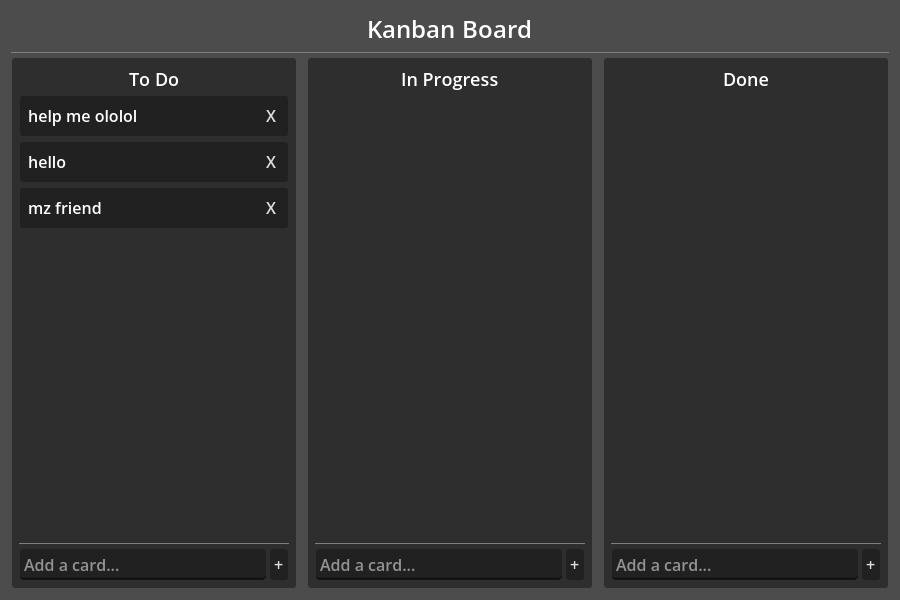

# Godot MCP Server

[](LICENSE)
[](https://godotengine.org/)
[](https://www.python.org/)

An [MCP (Model Context Protocol)](https://modelcontextprotocol.io/) server that connects [Claude Code](https://docs.anthropic.com/en/docs/claude-code) to the [Godot 4.6](https://godotengine.org/) game engine.

Claude can run your project, take screenshots, inspect and edit the scene tree, and iterate on your game — all from the terminal.



## What Can It Do?

| Tool | Description |
|------|-------------|
| `get_scene_tree` | Inspect the full node hierarchy in the editor |
| `get_node_properties` | Read any property on any node |
| `modify_node` | Change node properties (text, position, color, etc.) |
| `create_node` | Add new nodes to the scene |
| `delete_node` | Remove nodes from the scene |
| `set_resource` | Create and assign Resources (meshes, materials, etc.) to nodes |
| `attach_script` | Create and attach inline GDScript to a node |
| `set_script` | Assign an existing .gd file to a node |
| `get_signals` | List all signals on a node and their connections |
| `connect_signal` | Wire up a signal connection between two nodes |
| `instantiate_scene` | Add an existing .tscn as a child node |
| `list_resources` | List all project files (.tscn, .gd, .tres, etc.) |
| `run_project` | Launch the game from the editor |
| `run_scene` | Run a specific scene (not just the main scene) |
| `stop_project` | Stop the running game |
| `screenshot` | Capture the game viewport as a PNG image |
| `get_runtime_tree` | Inspect the live scene tree while the game runs |
| `save_scene` | Save the current scene |
| `open_scene` | Open a scene file in the editor |
| `get_editor_state` | Check which scene is open, whether the game is running |
| `get_output` | Read recent Godot editor log output (prints, errors) |
| `undo` / `redo` | Undo or redo the last editor action |

## How It Works

```
Claude Code ←stdio→ Python MCP Server ←TCP:9500→ Godot Editor Plugin
                                                       ↓
                                                  Running Game ←TCP:9501→ Python MCP Server
```

- **Python MCP Server** — Bridges Claude Code (via stdio) to Godot (via TCP). This is what Claude talks to.
- **Editor Plugin** — Runs inside the Godot editor. Listens on port 9500. Handles scene tree operations, running/stopping the project, saving.
- **Game Autoload** — Injected into the running game. Listens on port 9501. Captures screenshots and exposes the runtime scene tree.

Screenshots are sent as base64-encoded PNG over TCP — no temp files, no filesystem dependencies.

## Prerequisites

- [Godot 4.6](https://godotengine.org/download/) (standard or mono edition)
- [Python 3.10+](https://www.python.org/downloads/)
- [uv](https://docs.astral.sh/uv/getting-started/installation/) (Python package manager)
- [Claude Code](https://docs.anthropic.com/en/docs/claude-code) CLI

## Setup

### 1. Clone and open in Godot

```bash
git clone https://github.com/slangwald/godot-mcp.git
cd godot-mcp
```

Open `project.godot` in Godot 4.6. The MCP Bridge plugin is pre-configured and will activate automatically.

### 2. Register the MCP server with Claude Code

```bash
claude mcp add godot-mcp -- uv run --directory /absolute/path/to/godot-mcp/mcp python godot_mcp_server.py
```

> **Note:** Use the full absolute path to the `mcp/` directory. This only needs to be done once.

### 3. Start a new Claude Code session

MCP servers load at startup, so start a fresh session after registering:

```bash
claude
```

You should see the Godot tools available. With the Godot editor open, try:

```
> Use get_scene_tree to show me the current scene
> Run the project and take a screenshot
```

## Adding to Your Own Godot Project

The MCP server is not tied to the sample app. To use it with any Godot 4.6 project:

1. **Copy the plugin** — Copy `addons/mcp_bridge/` into your project's `addons/` directory

2. **Copy the game autoload** — Copy `mcp_bridge_game.gd` to your project root

3. **Enable the plugin** — In Godot: Project → Project Settings → Plugins → Enable "MCP Bridge"

4. **Add the autoload** — In Godot: Project → Project Settings → Autoload → Add `mcp_bridge_game.gd` as `McpBridgeGame`

   Or manually add to your `project.godot`:
   ```ini
   [autoload]
   McpBridgeGame="*res://mcp_bridge_game.gd"

   [editor_plugins]
   enabled=PackedStringArray("res://addons/mcp_bridge/plugin.cfg")
   ```

5. **Register the MCP server** with Claude Code (same command as above, pointing to this repo's `mcp/` directory)

## Sample App

The included Kanban board (`examples/kanban/`) is a simple demo for testing the MCP tools. Three columns (To Do, In Progress, Done), drag-and-drop cards, persistent storage via Godot Resources.

## Platform Support

Works on **macOS**, **Windows**, and **Linux**. All communication uses localhost TCP sockets and base64-encoded payloads — no platform-specific paths or dependencies.

## TCP Protocol

Both the editor plugin (port 9500) and game autoload (port 9501) use the same simple protocol:

- **Request:** JSON with a `"cmd"` key, newline-terminated
- **Response:** JSON, newline-terminated
- **Connections** are short-lived (connect → send → receive → close)

Example:
```json
{"cmd": "get_scene_tree"}
```
```json
{"ok": true, "tree": {"name": "Main", "type": "Control", "path": ".", "children": [...]}}
```

This means you can also use the Godot bridge from any TCP client, not just through the MCP server.

## Troubleshooting

**"Cannot connect to Godot editor on port 9500"**
- Make sure the Godot editor is open with this project (or a project with the MCP Bridge plugin enabled)

**"Cannot connect to Godot game on port 9501"**
- The game must be running. Call `run_project` first.

**Tools not showing up in Claude Code**
- MCP servers load at session startup. Start a new `claude` session after registering.
- Verify with `claude mcp list` — you should see `godot-mcp: ✓ Connected`

**Screenshot returns an error**
- The game must be running and have rendered at least one frame. Wait a moment after `run_project` before calling `screenshot`.

## License

MIT
